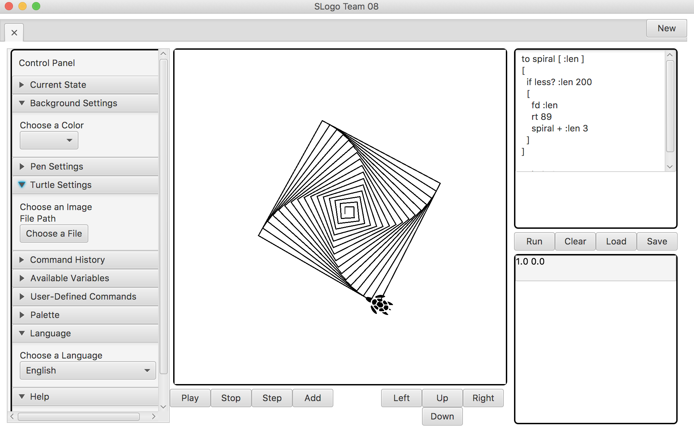

# slogo

A development environment that helps users write SLogo programs.

Names:
* Allen Qiu (asq3@duke.edu)

* Brooke Keene (bzk2@duke.edu)

* Duy Trieu (dvt5@duke.edu)

* Yunhao Qing (yq50@duke.edu)

### Timeline

Start Date: 10/15/2018

Finish Date: 10/29/2018

Hours Spent: 150 hours

### Primary Roles

* Allen Qiu : Back End Developer. Work on general models such as saver and loader, work on individual specific command class and the parser.

* Brooke Keene : Front End Developer.

* Duy Trieu : Front End Developer. I design the layout of the UI and the functionalities of the Screen, Script Editor, Console, and Dropdown. I also design the Controller class that connects the front end and the back end.

* Yunhao Qing : Back End Developer. Word on general model such as Turtle and VariableMap, work on the parser and error checking.

### Resources Used

###### Images

* [duvall.gif](https://users.cs.duke.edu/~rcd/images/rcd.jpg)
* [turtle.gif]()

###### Articles

* [Initialize a static final field in the constructor](https://stackoverflow.com/questions/5093744/initialize-a-static-final-field-in-the-constructor)
* [Integer.class vs int.class](https://l.messenger.com/l.php?u=https%3A%2F%2Fstackoverflow.com%2Fquestions%2F22470985%2Finteger-class-vs-int-class&h=AT0oxh3T6S7cgm3CMzhRzM-bvukfJYa5z3dXlGkvSAJkB-cd-ucubCPXM4pLevC69Rc95Srq_DW-I0h1FdTZsHNwYd470REraRFeRU-z1YK_47OpJFGXvmkI6ulIDw)
* [How to permanently remove few commits from remote branch](https://stackoverflow.com/questions/3293531/how-to-permanently-remove-few-commits-from-remote-branch)
* [Split() String method in Java with examples](https://www.geeksforgeeks.org/split-string-java-examples/)
* [Is there a way to instantiate a class by name in Java?](https://stackoverflow.com/questions/9886266/is-there-a-way-to-instantiate-a-class-by-name-in-java)
* [How to convert Double to int directly?](https://stackoverflow.com/questions/5404149/how-to-convert-double-to-int-directly)
* [How do I split a string with multiple spaces?](https://kodejava.org/how-do-i-split-a-string-with-multiple-spaces/)
* [Oracle documentation on Observable](https://docs.oracle.com/javase/7/docs/api/java/util/Observable.html)
* [Oracle documentation on Shape](https://docs.oracle.com/javase/8/javafx/api/javafx/scene/shape/Shape.html)
* [Oracle documentation on InvocationTargetException](https://docs.oracle.com/javase/7/docs/api/java/lang/reflect/InvocationTargetException.html)
* [Oracle documentation on JavaFx Color](https://docs.oracle.com/javafx/2/api/javafx/scene/paint/Color.html)
* [The Java ternary operator examples](https://alvinalexander.com/java/edu/pj/pj010018)

* [JavaFX Dialogs](https://code.makery.ch/blog/javafx-dialogs-official/)
* [How to Handle Jave Exception](https://stackify.com/specify-handle-exceptions-java/)
* [Designing with Interfaces](https://www.artima.com/designtechniques/interfaces.html)
* [Designing with Exceptions](https://www.javaworld.com/article/2076721/core-java/designing-with-exceptions.html)
* [OO in one Sentence](https://media.pragprog.com/articles/may_04_oo1.pdf)

### UI Layout of the project

### How to use the program

To run SLogo, simply type the commands in the script editor and press Run to execute the commands. Hit play to watch the turtle move around the screen. The dropdown button collumn in the left allows users to look into and change variables pertaining to the pen, turtle and history command.

### Known Bugs
* Current turtle info doesn't always update consistently
* When you have multiple windows, the control panel will expand beyond the bottom of the screen
* Error checking system is not thorough. Sometimes the system doesn't catch the error and print out in the console in IntellJ. However, the error does not crash or stop the program.

### Design decision
* For the backend, we decide to use a tree for parsing commands instead of other data structures like Linkedlist or ArrayList. By using a tree, we can execute a command when its parameters are fulfilled.
* For the front end, we decide to create seperate classes for each components of the UI. This helps us to structure our code better and encapsulate many additional features when needed. 
* We decide to create a Turtle class in the backend that is parsed through the Command Parser and return its x, y coordinates, and orientation accordingly. We then having a TurtleDriver class in the front end that receives the information from the backend and updates the ImageView, animation, and pen for the UI. This proves to be very easy and effective way of communicating the getting information for the turtle.
* We decide to include a Controller class that connects the frontend and the backend. The Controller classes would return multiple objects to communicate between the frontend and the backend using lambdas. By doing this, everywhere we have a Controller object, we could access the information from both the frontend and the backend effectively and safely.

### Extra features

* We add Duvall's face as an image of the turtle. 

### Impression

* Allen Qiu : This project is very challenging but I learnt so much about APIs and Reflection and I truly appreciate the power of JavaFX now! Although it is time-consuming, the project is definitely worth doing. I realise how much I enjoy backend coding and I aspire to be a backend engineer in the future!

* Brooke Keene : Slogo is more challenging compared to the previous two projects, breakout and cell society. I learn how to work with a team by using interfaces and I truly feel I can work better in a team setting in the future. I did front end this time and I am very satisfied with my role in this project.

* Duy Trieu : This project is very challenging in its concept and design. I learn a lot about APIs, Lambda, and Reflection. I had a great time design and implementing the front end and also learn how to connect the front end and the back end, which is very valuable for me. 

* Yunhao Qing : I spent lots of time on writing the parser and I am very glad that it works eventually! This project has been fun and I had a great time with my teammates who are amazing! I feel I have learnt much about API and it is going to be super helpful for my future.