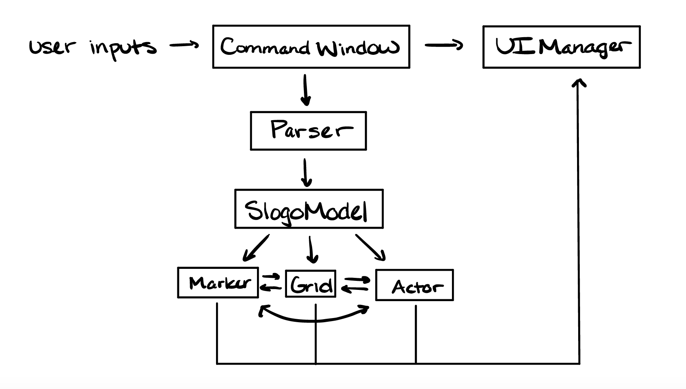

SLogo Architecture Design
===

### Names

Allen Qiu (asq3@duke.edu)
Brooke Keene (bzk2@duke.edu)
Duy Trieu (dvt5@duke.edu)
Yunhao Qing (yq50@duke.edu)

### High Level Description
* Actor class
    * Actor interacts with the grid class as it moves along and the marker class since it leaves behind a trail. Actor is also displayed by the UI manager.
* Grid class
    * Grid has the actor move along it and has the marker placed on top of it. It is displayed in the UI manager.
* Marker class
    * The marker class is left behind by the actor and is displayed on top of the grid. It is displayed in the UI.
* CommandWindow class
    * The CommandWindow class will represent a text editor that users can interact with.
* UI manager class
    * The UI manager has controls and shows the actor, the grid, the marker, as well as the command window
* Parser class
    * Parser would act as a communicator between the CommandWindow class and the SlogoModel class. It would interpret commands, check for erros, and send the correct information to the UIManager or SLogoModel class
* SLogoModel class
    * The SLogoModel class is the main backed that processes inputs from the parser and updates positions and sends it to the UI manager

### Questions
* What is the result of parsing and who receives it?
    * The CommandWindow class takes in the user inputed code and sends it to the parser, where error checking is done. Finally, if it is a valid command, the SLogoModel class updates accordingly.
* When does parsing need to take place and what does it need to start properly?
    * Parsing needs to take place after the command is given to the CommandWindow class and needs to be compared to a list of valid commands. It also needs to interact with the grid to check boundaries and also the actor for direction.
* When are errors detected and how are they reported?
    * The parser detects and checks for errors and are reported directly to the UI manager.
* What do commands know, when do they know it, and how do they get it?
    * We will accept commands that take in a direction and distance. We will also accept commands that handle programming logic and conditionals. 
    * Commands know this information after a user presses the ENTER key and the information is communicated via the Parser
* How is the GUI updated after a command has completed execution?
    * The UI manager gets an updated actor location from the SLogoModel class and updates its position and direction. The Marker class also updates the path drawn by the actor.
    
### Image
