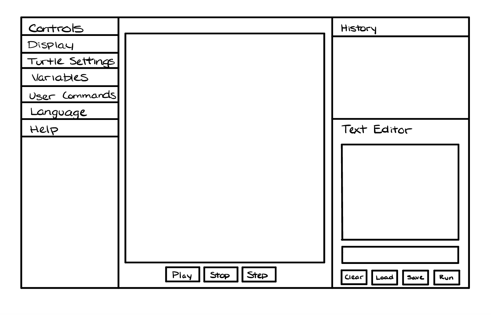

SLogo Team 8 
===

### Introduction

For this project, we would like to implement a program that provides an IDE for the Logo programming language. The IDE should be able to move and direct a turtle on a grid graphically on a per-expression basis. This turtle should also be able to leave a trail on the grid indicating where it has and has not gone. The IDE should be flexible enough to handle errors, customize the visual aspect, and interpret different SLogo commands in different languages. Additionally, the IDE should be able to save the user's command history, keep a bank of the user's saved commands, and provide a comprehensive programming environment for the SLogo language.

### Design Overview
The four APIs we plan to have:
- External
    - Front end
        - The front end external API should allow for commands in SLogo to customize the view of the turtle. For example, changing the size of the turtle, the color of the turtle, the width of the marker, the color of the marker, and other methods that will support the parser when it modifies the front end.
    - Back end
        - The back end external API contains instance variables of the backend classes that we need. The front end will interact directly with these interfaces as it requires access to specific data. The front end should be able to retrieve information about the turtle and the history user inputs by interacting with these interfaces.
- Internal 
    - Front end:
        - The internal API for the front end should deal strictly with visual elements of the GUI that we would not want an external contributor to change, such as the handling of the language of the GUI, placement of the different panes for the GUI, or formatting/spacing.
    - Back end:
        - The internal API for the back end should be able to take in and process commands entered by the user that require no front-end interactions. This involves parsing and making sense of the instructions inputted.

### User Interface

There will be four components on our program's interface. The first component is the canvas in the middle displaying the grid, the turtle or sprite, the movements of the turtle and the marks as a result of its movements. 

The second component is control panel that shows the different settings we can have for the turtle, the canvas, the script editor, and the IDE in general. The control panel will be located at the left, next to the canvas.

The third component is the command-line interface and code editor where the user can put in commands like 'forward', 'turn', or 'clear' and run them line by line or compile multiple lines of code. This command-line interface component will be located in the bottom right corner.

The fourth component is the command history where the user can view their most recent commands. The history panel will be located in the top right corner, above the command-line interface and code editor.

### API Details 

1.SLogoInternalFrontend
  - TurtleView
  - CommandView
  - ScriptView
  - ControlView

2.SLogoExternalFrontend

  - SLogoView (a class that displays the objects and data that we get from the controller)

3.SLogoExternalBackend
 
  - SLogoModel (contains instance variables of the backend classes that we need, the front end can retrieve information such as turtle information and history user inputs by interating with this class.)

4.SLogoInternalBackend

 - CommandParser
 - ScriptParser
 - Executer

### API Example Code

Below is our plan for the interface SLogoInternalFrontend.
    
    public Interface SLogoInternalFrontend {
        public class TurtleView{
            public void update(TurtleInfo info);
        }

        public class CommendView{
           public String getCurrentCommand(); 
           
           public void displayHistory(); 
        }

        public class ScriptView{
        
            public String getCurrentScript(); 

        }

        public class ControlView{
            public Map<String,String> getCurrentVariables(); 

        }
    }

Below is our plan for the interface SLogoExternalFrontend.

    public Interface SLogoExternalFrontend{
        public class SLogoView{
            public void initialDisplay()
            public void updateDisplay()
        }
    }

Below is our plan for the interface SLogoExternalBackend.

    public Interface SLogoExternalBackend {
    
    }
    
    
    
Below is our plan for the interface SLogoInternalBackend.

    public Interface SLogoInternalBackend{

        public class SLogoModel {

            public void parse(String input);

            public List<String> getHistory();

            public TurtleInfo getTurtleInfo();

            public List<Variable> getParameters();
            }
    }

The user types 'fd 50' in the command window, and sees the turtle move in the display window leaving a trail, and the command is added to the environment's history.

To accomplish this, we need the following steps to occur:
- The backend should recognize that a command was inputted and should be able to parse it using parse(String command)
- In the backend, this command should be added to the history using add(String command)
- The step() function in the backend should recognize that there is no direction change needed and should update the UIManager to set the x or y position +50 using setXPosition(int x) and setYPosition(int y)
- The actor object should be moved using a method call move()
- A marker object should be added using add(int startX, int startY, int endX, int endY)
    
### Design Considerations 
- Flexibility
    - After we discovered the unpleasant surprise that was the complete implementation of CellSociety, we all agree that the program needs to be as flexible as possible
    - Taking this into consideration, the following are examples of areas where our design should be as flexible as possible:
        - Turtle size/color
        - Number of turtles
        - Marker thickness/color
        - Grid display/color
- UI design
    - Having worked with a variety of IDEs in the past, we collectively agreed on having the following design of our IDE to be the most user friendly:
        - The left side should contain the variables currently in use and settings (for the turtle, pen, grid, etc.) 
        - The middle should contain the visualization of the turtle
        - The right side show be the input area for commands and should show the history of commands put
        - Buttons should be at the bottom such as play, pause, step, save, load, etc.

### Team Responsibilities
- Allen
    - Versatile front end/back end
- Duy
    - Versatile front end/back end
- Yunhao
    - Back end
- Brooke
    - Front end

